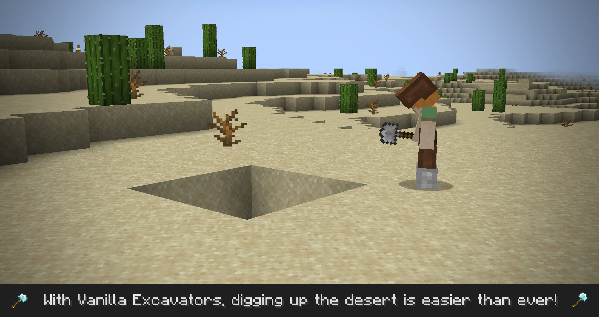

# Vanilla Excavators

Vanilla Excavators is a shovel alternative to [Vanilla Hammers](https://github.com/Draylar/vanilla-hammers/). instead of mining stone, excavators dig dirt!

## Installation

1. Install the Fabric Launcher from https://fabricmc.net/use/
2. Install the Fabric API jar as a mod from https://minecraft.curseforge.com/projects/fabric
3. Install the latest version of Vanilla Hammers from https://www.curseforge.com/minecraft/mc-mods/vanilla-excavators

## License & Libraries

Vanilla Excavators is licensed under MIT. It bundles the following libraries:

- [Magna](https://github.com/Draylar/magna) by Draylar & contributors (MIT)
- [Omega Config](https://github.com/Draylar/omega-config) by Draylar & contributors (MIT)